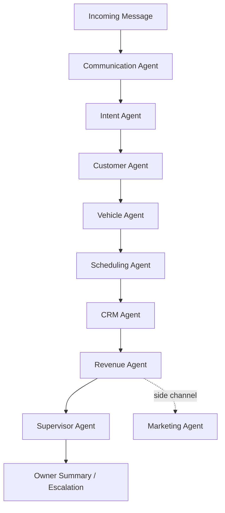
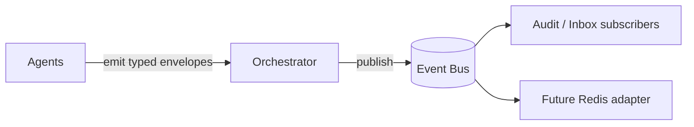

# ADR 0003 — Phase 5 Modular AI Agent Framework

## Status

Accepted (Phase 5)

## Context

The product brain must handle multi-channel customer communication (phone, SMS, email,
Facebook, website chat, walk-in) without becoming a single monolithic AI service.
Future MCP (Model Context Protocol) tooling requires clear agent boundaries and tool
descriptors.

## Decision

1. Ship a **modular agent framework** under `apps/api/app/agents/`.
2. Each agent has **one responsibility**, its own folder, interfaces, services, and tests.
3. Agents communicate through an **internal event bus** (`EventBus` Protocol +
   `InMemoryEventBus` default). Redis/NATS adapters can replace the transport later.
4. An **`AgentOrchestrator`** runs the canonical inbound pipeline and publishes typed
   events at each stage.
5. Expose agent capabilities via **`McpToolRegistry`** so an MCP server can be layered
   on without rewriting domain logic.
6. Shared concerns live in `agents/base/`: DI-friendly base class, retry, logging,
   config (`AGENT_*`), and error hierarchy.

### Canonical communication flow

### Event bus topology

### Agent responsibilities

| Agent | Responsibility |
|---|---|
| Communication | Normalize phone/SMS/email/Facebook/website/walk-in into one format |
| Intent | Detect intent → structured JSON |
| Customer | Find / create / merge / profile |
| Vehicle | Find / create / mileage / history / maintenance timeline |
| Scheduling | Slots / book / reschedule / cancel / reminders |
| CRM | Communication + repair history + timeline + summary |
| Revenue | Upsells / declined estimates / churn / prediction |
| Marketing | SMS/email campaigns, reviews, thank-you, reminders |
| Supervisor | Errors, conflicts, escalation, owner summary |

## Consequences

- Domain CRM services remain the source of truth; agent directories are ports that
  production adapters can bind to existing UoW repositories.
- Heuristic intent detection ships for local/dev; swap via `IntentAgentPort`.
- HTTP ingest available at `POST /v1/agents/inbound`; MCP descriptors at
  `GET /v1/agents/mcp/tools`.
