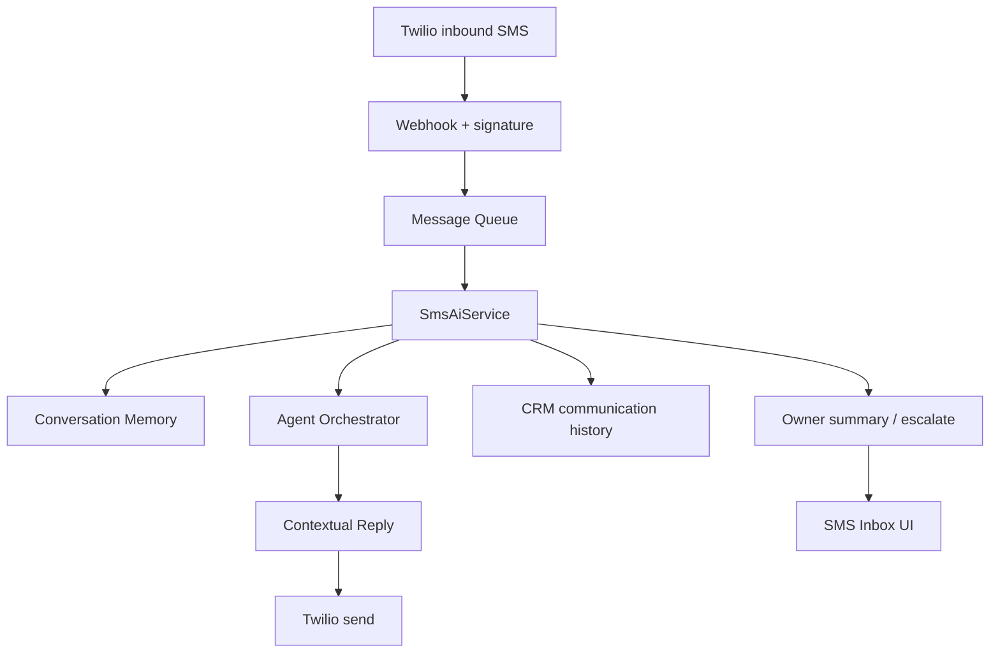

# ADR 0004 — Phase 6 Twilio SMS AI

## Status

Accepted (Phase 6)

## Context

Shops need an automated SMS front desk that books/moves/cancels appointments,
remembers each customer conversation, escalates hard cases, and updates CRM —
without a monolithic chatbot. Phase 5 already provides specialized agents + an
event bus.

## Decision

1. Build **SMS AI** on top of the agent orchestrator (`channel=sms`).
2. Use **Twilio** as the SMS provider (`TwilioSmsProvider`) with a **fake** provider
   for local/dev/tests.
3. Persist threads in `sms_conversations` / `sms_messages` (plus in-memory store for
   unit tests / default runtime).
4. Keep **conversation memory** per `(shop_id, customer_phone)` with locks so many
   chats can run at once.
5. Ingest via **Twilio webhook** → **message queue** (memory or Redis) with retry →
   agent pipeline → contextual reply → outbound SMS + CRM communication history.
6. Expose an **SMS Inbox** UI: conversation list, thread, reply preview, customer
   timeline, owner summary, human takeover.

### Flow

## Consequences

- `TWILIO_SHOP_MAP` or `shops.sms_phone_e164` maps To-number → shop.
- Human takeover pauses AI replies while still recording inbound messages.
- Monitoring metrics available at `/v1/sms/metrics` and webhook health.
