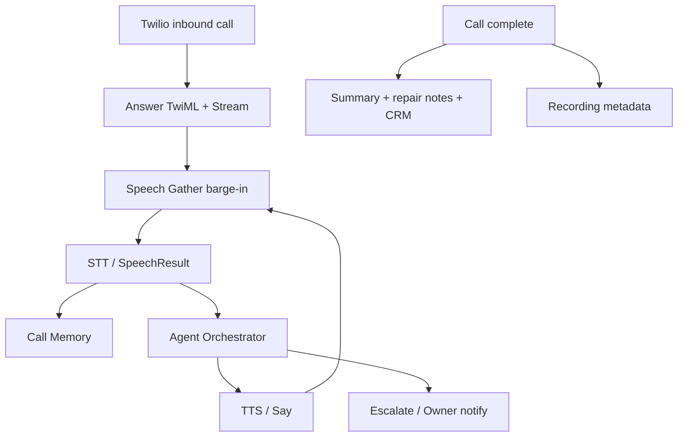

# ADR 0005 — Phase 7 Twilio Voice AI

## Status

Accepted (Phase 7)

## Context

Shops need an AI that answers every phone call with natural, interruptible
conversation — booking/moving/cancelling appointments, repair status, estimates,
and maintenance — while escalating hard cases to humans. Phase 5 agents and
Phase 6 SMS patterns provide the foundation.

## Decision

1. Build **Voice AI** under `apps/api/app/voice/` mirroring the SMS module.
2. Use **Twilio Voice** webhooks (`/v1/webhooks/twilio/voice`) with:
   - `<Gather input="speech" bargeIn="true">` for interruptible speech
   - `<Say>` / TTS pipeline for replies
   - Media Streams websocket for streaming audio support
   - Recording status callbacks for metadata storage
3. Route spoken turns through the **agent orchestrator** (`channel=phone`).
4. Maintain **per-call conversation memory**, generate **call summary** +
   **structured repair notes** on completion, and write CRM timeline entries.
5. Expose a **Voice Calls** dashboard: live calls, history, transcript, summary,
   takeover, and owner escalation notifications.

### Flow

## Consequences

- `TWILIO_VOICE_SHOP_MAP` / `shops.voice_phone_e164` maps To-number → shop.
- Heuristic STT/TTS for local; OpenAI Whisper + TTS when `AI_PROVIDER=openai`.
- Human takeover dials Twilio Client `shop` and pauses AI turns.
