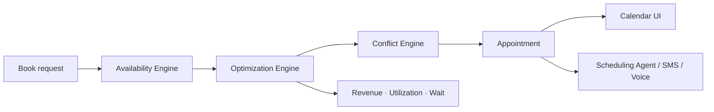

# ADR 0006 — Phase 8 AI Appointment Intelligence

## Status

Accepted (Phase 8)

## Context

Booking a slot is not enough. Shops need the schedule optimized across mechanics,
skills, bays, repair duration, priority/emergencies, walk-ins, and existing work —
with conflict detection, capacity forecast, and wait prediction.

## Decision

1. Add `apps/api/app/scheduling/` with four engines:
   - **AvailabilityEngine** — hours, mechanic/bay free windows, duration estimates
   - **ConflictEngine** — overlaps, overbooking, severity
   - **OptimizationEngine** — rank slots, recommend mechanic/bay, forecasts, improvements
   - **AppointmentIntelligenceService** — book / reschedule / cancel orchestration
2. Adapt the Phase 5 `SchedulingAgent` via `IntelligenceSchedulingStore` so SMS/Voice
   bookings use the same optimized schedule.
3. Persist schema in Alembic `0008_phase8_appointments` (mechanics, bays, hours,
   appointments); runtime defaults to seeded in-memory store for local/tests.
4. Dashboard calendar: day / week / mechanic timeline / bay timeline + appointment
   detail and AI insights (revenue, utilization, wait, improvements).

## Consequences

- Agent bookings assign mechanic + bay and estimate completion/wait/revenue.
- Overbook and skill-mismatch suggestions surface in `/insights/optimize`.
