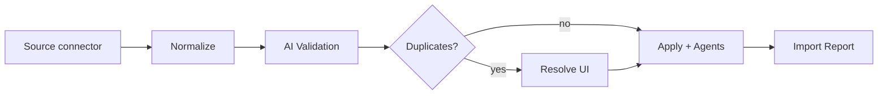

# ADR 0007 — Phase 9 Import Engine

## Status

Accepted (Phase 9)

## Context

Shops migrate from Tekmetric, Shopmonkey, AutoLeap, Mitchell, spreadsheets, PDFs,
and paper/OCR dumps. Imports must normalize into standard entities, detect
duplicates, validate VINs/mileage, and present a wizard with progress, reports,
and merge resolution — not a blind bulk insert.

## Decision

1. Add `apps/api/app/import_engine/` with priority-ordered connectors:
   API (Tekmetric / Shopmonkey / AutoLeap / Mitchell) → CSV → Excel → PDF → OCR → Manual.
2. Normalize into canonical entities: Customer, Vehicle, Repair History, Invoices,
   Estimates, Communication History, Appointments, Recommendations.
3. **ValidationEngine** detects duplicates, suggests merges, validates VIN check
   digits, and flags inconsistent mileage; apply path uses the Phase 5 agent
   customer/vehicle resolve APIs.
4. Job lifecycle: create → upload/configure → parse/normalize/validate →
   awaiting_resolution (optional) → apply → report. In-memory store for local/tests;
   Alembic `0009_phase9_import` for persistence schema.
5. Dashboard `/dashboard/import`: wizard, progress, duplicate resolution, report.

## Consequences

- Historical data lands as shop-scoped import records with merge audit.
- Source priority is explicit (`SOURCE_PRIORITY`) for multi-source conflict policy.
- OCR/PDF share field extractors (VIN, mileage, customer, invoice, recommendations).
