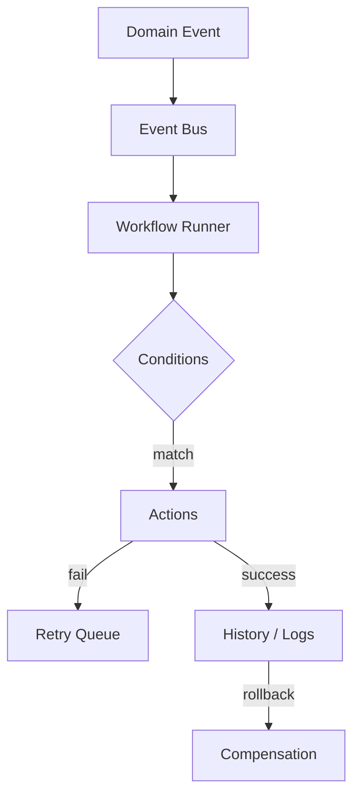

# ADR 0008 — Phase 10 Workflow Engine

## Status

Accepted (Phase 10)

## Context

Shop operations must become event-driven: when an appointment is booked, reminders,
CRM, revenue, and dashboards should update through declarative workflows — not
ad-hoc service calls. Operators need a builder, run history, debugger, retries,
and rollback.

## Decision

1. Add `apps/api/app/workflows/` with:
   - **WorkflowEventBus** — pub/sub for domain events (+ durable event log)
   - **WorkflowRunner** — condition match → ordered actions → logging/history
   - **RetryQueue** — exponential backoff for failed steps
   - **ActionExecutor** — schedule_reminder, update_crm/revenue/dashboard, emit,
     notify, log, with compensation for rollback
2. Supported domain events include customer/vehicle/repair/estimate/invoice/
   appointment/walk-in/review plus cascade events (`reminder.scheduled`,
   `crm.updated`, `revenue.updated`, `dashboard.updated`).
3. Default seeded cascade: `appointment.booked` → Reminder → CRM → Revenue → Dashboard.
4. Scheduling `book` / `cancel` emit domain events via `emit_domain_event`.
5. Dashboard `/dashboard/workflows`: Builder, History, Debugger.
6. Schema: Alembic `0010_phase10_workflows`.

## Consequences

- Cross-module side effects move behind workflows; agents/services emit events.
- Global templates are clone-on-write (shop cannot mutate templates in place).
- Revenue UI consumes `revenue.updated` events produced by workflows.
