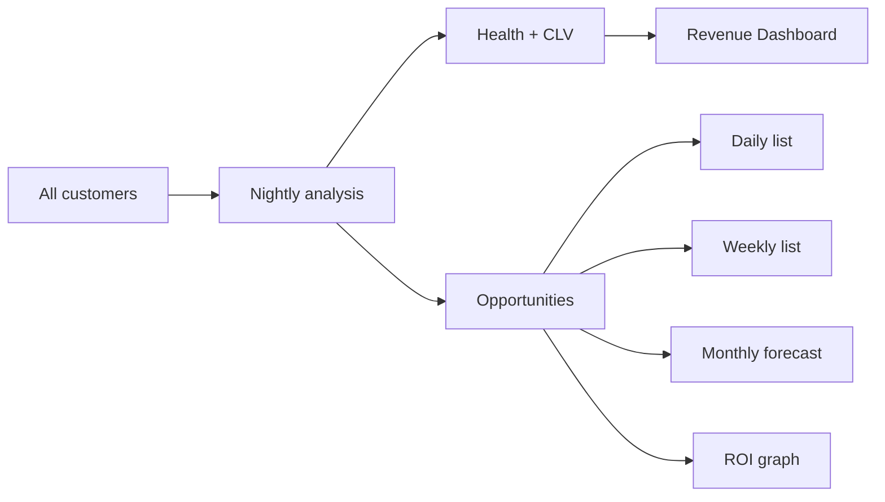

# ADR 0009 — Phase 11 Revenue Intelligence Engine

## Status

Accepted (Phase 11)

## Context

Shops need automatic revenue growth: every night, analyze all customers across
repair history, maintenance, mileage, visit frequency, declined estimates,
communications, seasonality, CLV, and vehicle age — then produce contact-ready
opportunities with probability and ROI.

## Decision

1. Add `apps/api/app/revenue_intel/` with:
   - **RevenueAnalysisEngine** — per-customer analyzers + opportunity generation
   - **Scoring** — customer/vehicle health, CLV, probability, ROI
   - **Messaging** — channel + message recommendations
   - **Nightly job** via `run_nightly_analysis` (dashboard auto-runs if empty)
2. Opportunity kinds: lost customers, likely return/accept, maintenance overdue,
   battery/brakes/oil/tires/alignment/fluids, declined estimates.
3. Outputs: daily/weekly opportunity lists, monthly forecast, health scores, ROI series.
4. Bridge to Phase 5 `RevenueAgent` via `agent_adapter.opportunities_to_agent_insights`.
5. Dashboard `/dashboard/revenue` replaces the Phase 10 placeholder.
6. Schema: Alembic `0011_phase11_revenue`.

## Consequences

- Outreach is prioritized by expected revenue × probability / contact cost.
- In-memory store seeds demo customers for local/tests; SQL tables ready for production adapter.
