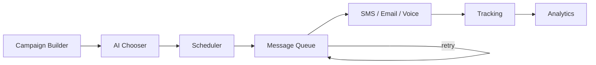

# ADR 0010 — Phase 12 Marketing Automation

## Status

Accepted (Phase 12)

## Context

Shops need multi-channel campaigns (SMS, Email, Voice) with AI choosing the best
time, channel, message, and frequency — plus tracking of opens, clicks, replies,
appointments, revenue, and ROI. Delivery requires a scheduler, queue, retries,
and logging.

## Decision

1. Add `apps/api/app/marketing/` with:
   - **MarketingAiChooser** — best channel/time/message/frequency
   - **CampaignScheduler** — materialize plans → messages
   - **MessageQueue** — due processing + exponential retry
   - **ChannelRouter** — SMS/Email/Voice adapters (in-memory providers by default)
2. Campaign types: maintenance reminder, declined estimate, thank you, review
   request, seasonal promotion, recall notice, birthday, inactive customer.
3. Tracking events: open / click / reply / appointment / revenue → rates + ROI.
4. Dashboard `/dashboard/marketing`: Builder, Calendar, Analytics.
5. Schema: Alembic `0012_phase12_marketing`.

## Consequences

- Phase 5 MarketingAgent remains the conversational side-channel; Phase 12 owns
  durable campaigns and metrics.
- Providers are swappable (Twilio/SendGrid) without changing campaign APIs.
