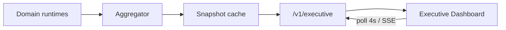

# ADR 0011 — Phase 13 Executive Dashboard

## Status

Accepted (Phase 13)

## Context

Owners and managers need a single realtime command center: revenue, appointments,
missed calls, walk-ins, AI conversations, escalations, opportunities, marketing
ROI, satisfaction, and mechanic productivity — plus charts and action widgets.

## Decision

1. Add `apps/api/app/executive/` with:
   - **ExecutiveAggregator** — pulls live metrics from scheduling, revenue intel,
     marketing, SMS, voice, and workflows runtimes
   - **ExecutiveDashboardService** — short-TTL cache (≈5s) for realtime polls
   - **SSE** `/v1/executive/stream` + JSON `/v1/executive/dashboard`
2. Dashboard composition:
   - **Cards** — the 11 KPI tiles
   - **Charts** — revenue, appointments, retention, vehicle types, services,
     customer sources, AI performance
   - **Widgets** — today's tasks, customers to contact, declined estimates,
     pending approvals, repair status
3. Overview route `/dashboard` becomes the Executive Dashboard UI with 4s polling.
4. Schema: Alembic `0013_phase13_executive` for snapshot/live-state persistence.

## Consequences

- Cold shops still render a full dashboard via seeded/fallback KPIs when monitors
  have no traffic yet.
- Domain packages remain source of truth; executive layer only aggregates.
