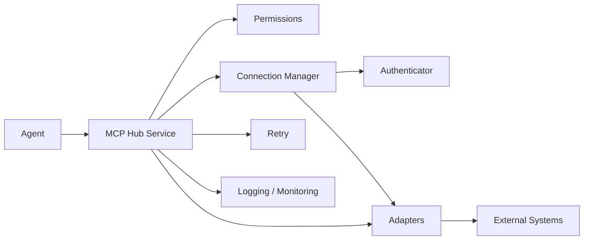

# ADR 0012 — Phase 14 MCP Integration Hub

## Status

Accepted (Phase 14)

## Context

AI agents need a production-ready way to talk to external systems (PMS, calendar,
telephony, payments, social, email) with consistent authentication, permissions,
connection lifecycle, retries, monitoring, logging, and API versioning.

## Decision

1. Add modular package `apps/api/app/mcp_hub/` with:
   - **Adapters** — one module per provider behind `IntegrationAdapter` protocol
   - **ConnectionManager** — create / connect / disconnect / test / delete
   - **ConnectionAuthenticator** — credential validation via adapter
   - **PermissionService** — principal × provider × action grants
   - **RetryExecutor** — exponential backoff on transient failures
   - **IntegrationLogger** + **McpHubMonitor** — audit trail and counters
   - **VersionService** — negotiate supported `api_version` per provider
2. Expose MCP-compatible tool descriptors at `GET /v1/mcp-hub/tools` and agent
   invoke at `POST /v1/mcp-hub/invoke`.
3. Supported providers: Tekmetric, Shopmonkey, AutoLeap, Google Calendar,
   Google Business, Twilio, Stripe, Facebook, Email, plus a **Future** slot.
4. UI at `/dashboard/integrations`; schema via Alembic `0014_phase14_mcp_hub`.

## Consequences

- New providers are added by registering an adapter — hub wiring stays unchanged.
- Demo credentials (`demo=true`) enable local/dev without live secrets.
- Existing agent MCP registry remains for in-process tools; this hub is the
  external-system surface.
