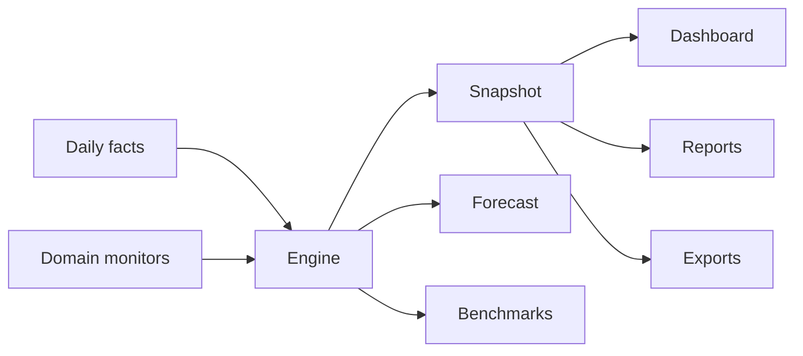

# ADR 0014 — Phase 16 Analytics Engine

## Status

Accepted (Phase 16)

## Context

Shops need production analytics beyond the Executive command center: durable KPIs,
forecasts, industry benchmarks, generated reports, and CSV/JSON exports.

## Decision

1. Add `apps/api/app/analytics/` with:
   - **AnalyticsEngine** — Revenue, Retention, ARO, CLV, Appointment Conversion,
     Marketing ROI, Mechanic Productivity, AI Success Rate
   - **ForecastEngine** — linear trend + weekend dampening
   - **Benchmarks** — industry avg / top-quartile comparison
   - **ReportBuilder** — executive, revenue, retention, marketing, ops, AI, full
   - **ExportService** — CSV + JSON artifacts with download API
2. Cold shops auto-seed 90 days of daily facts so dashboards are never empty.
3. Frontend `/dashboard/analytics` with Dashboard / Reports / Exports tabs.
4. Schema via Alembic `0016_phase16_analytics`.

## Consequences

- Executive Dashboard remains realtime ops view; Analytics is period KPIs + reporting.
- Forecast is intentionally dependency-free; can swap for Prophet/ML later.
