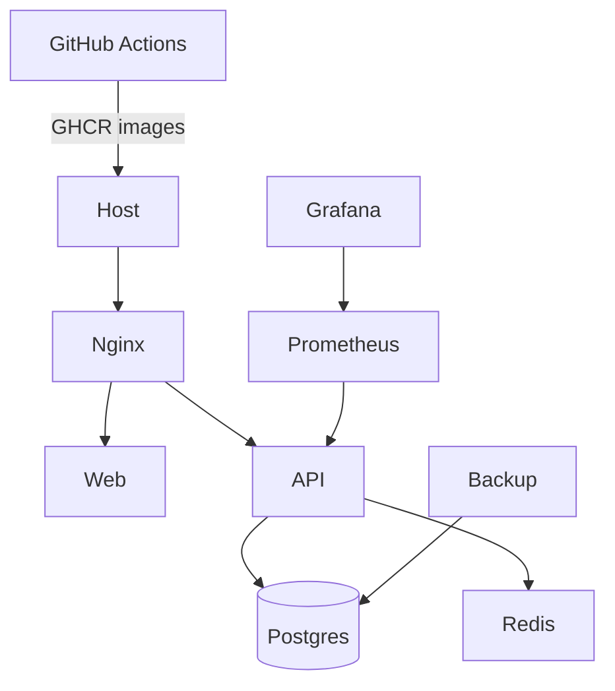

# ADR 0015 — Phase 17 Production Deployment

## Status

Accepted (Phase 17)

## Context

The product needs a production-ready deployment path: container images, Compose
orchestration, CI/CD, HTTPS, secrets handling, health probes, Prometheus/Grafana,
backups, and scaling guidance.

## Decision

1. Ship Dockerfiles under `deploy/docker/` for API and Web (non-root, healthchecks).
2. Provide `docker-compose.prod.yml` with Nginx TLS termination, API/Web, Postgres,
   Redis, Prometheus, Grafana, exporters, and a backup cron sidecar.
3. Expose `/live`, `/ready`, `/health`, `/metrics` from the API; add metrics middleware.
4. GitHub Actions: `ci.yml` (test/lint/build) and `deploy.yml` (GHCR publish).
5. Document operations in `docs/deployment/PRODUCTION.md`.
6. Alembic `0017_phase17_production` for deployment audit trail table.

## Consequences

- Local `docker-compose.yml` remains DB-only for developer ergonomics.
- Self-signed certs are for staging; production must swap in real certificates.
- Compose `deploy.replicas` is Swarm-oriented; plain Compose should use `--scale`.
