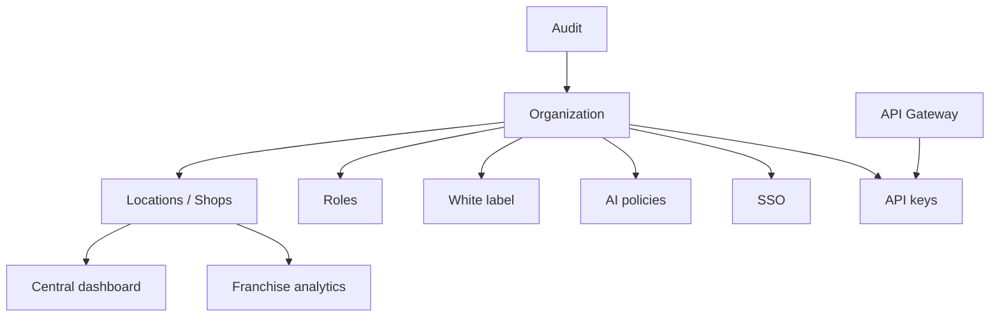

# ADR 0016 — Phase 18 Enterprise Features

## Status

Accepted (Phase 18)

## Context

Independent shops grow into multi-location franchises. They need organization-level
control: locations, role hierarchy, central dashboards, franchise analytics, custom
AI policies, white-label branding, audit trails, SSO, and an API gateway.

## Decision

1. Add `apps/api/app/enterprise/` with Organization → Location (shop) hierarchy.
2. Enterprise roles ranked above shop roles: franchise_owner → org_admin →
   regional_manager → location_manager → location_staff / auditor / api_client.
3. Central dashboard aggregates location KPIs; franchise analytics ranks locations.
4. AI PolicyEngine evaluates allow / deny / require_human rules per org/location.
5. WhiteLabelBrand drives product name/colors/domain for UI theming.
6. AuditLogger records enterprise mutations and gateway/SSO events.
7. SsoService supports OIDC/SAML/Google/Microsoft/Okta config + demo exchange.
8. ApiGateway provides route registry, API keys, and RPM rate limits.
9. UI at `/dashboard/enterprise`; schema via Alembic `0018_phase18_enterprise`.

## Consequences

- Shop-level JWT auth remains unchanged; enterprise APIs sit alongside.
- Runtime defaults to in-memory store; SQL tables ready for persistence adapters.
- Gateway is an authorize/control plane — Nginx still terminates TLS at the edge.
