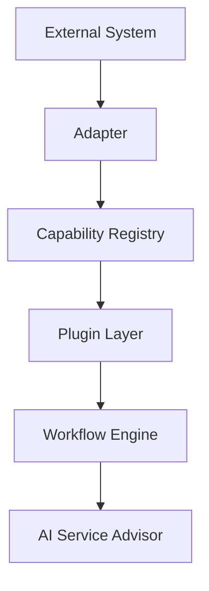
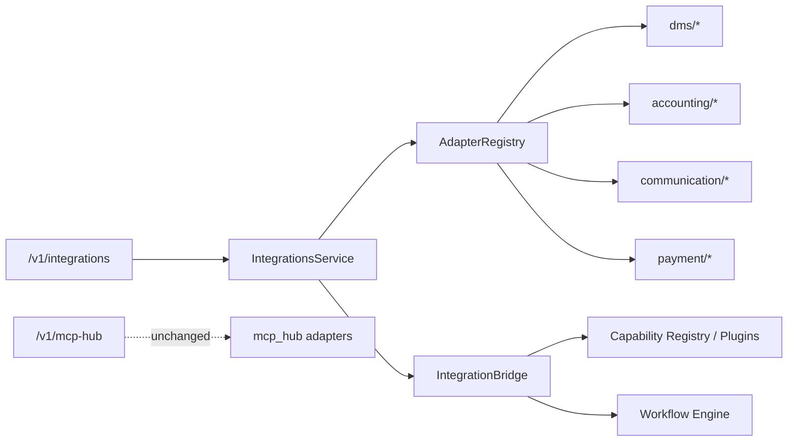

# ADR 0021 — External Integration Layer (Architecture Phase 18)

Status: Accepted

## Context

The platform must connect to existing automotive repair software and business
tools without replacing CRM, Workflow Engine, Plugin Framework, MCP Hub, or
Import Engine. Product Phase 18 Enterprise (`ADR-0016`) is unchanged.

## Decision

1. Add `apps/api/app/integrations/` as an **adapter-only** External Integration Layer:

```
integrations/
  core/          # interface.py, adapter.py, registry.py
  dms/           # Shopmonkey, Tekmetric, AutoLeap
  accounting/    # QuickBooks
  communication/ # Twilio, Email
  payment/       # Stripe
  bridge.py      # → Plugin Layer → Workflow Engine
  service.py / factory.py / plugin.py / api.py
```

2. Every external system communicates **only through adapters**.
3. Integration flow:



4. Capabilities: `ImportCustomerData`, `ImportVehicleData`,
   `ImportRepairHistory`, `SyncAppointment`, `SyncInvoice`, `SyncPayment`,
   `SendCustomerMessage`, `ReceiveCustomerMessage`.
5. All imported data includes `tenant_id` (+ `shop_id`). No cross-shop access.
6. MCP Hub (`/v1/mcp-hub`) remains the agent tool surface; this layer exposes
   `/v1/integrations` for sync/import orchestration.
7. Schema: Alembic `0020_external_integrations` (cursors + audit + RLS).

## Adapter Design

| Provider | Category | Capabilities |
|---|---|---|
| Shopmonkey | DMS | Import*, SyncAppointment, SyncInvoice |
| Tekmetric | DMS | Import*, SyncAppointment |
| AutoLeap | DMS | Import*, SyncAppointment |
| QuickBooks | Accounting | ImportCustomerData, SyncInvoice, SyncPayment |
| Twilio | Communication | Send/ReceiveCustomerMessage |
| Email | Communication | Send/ReceiveCustomerMessage |
| Stripe | Payment | SyncInvoice, SyncPayment |

`BaseAdapter` stamps tenant fields, filters cross-tenant records, and supports
demo credentials. Live HTTP transport remains optional (MCP Hub for agent invoke).

## Data Mapping

| External | Canonical (`TenantScopedRecord`) | Downstream |
|---|---|---|
| Customer | `entity_type=customer` + tenant stamp | Plugin `CreateCustomer` |
| Vehicle | `entity_type=vehicle` | Plugin `CreateVehicle` |
| Repair history | `entity_type=repair` | Plugin `AddRepair` |
| Appointment | `entity_type=appointment` | Scheduling + `appointment.booked` |
| Invoice / Payment | `entity_type=invoice\|payment` | Dashboard / `invoice.paid` |
| Message | `entity_type=message` | `AddCommunication` / inbound event |

Mapping helpers live in `integrations/mapping.py`.

## Security Model

- `TenantContext` requires `shop_id`; `tenant_id` defaults to `shop_id`.
- `stamp_tenant` / `assert_same_tenant` / store shop checks block cross-shop reads.
- HTTP API rejects `tenant_id != authenticated shop_id` (403).
- RLS on `integration_sync_*` tables via `app.shop_id`.
- Demo mode for local/dev; secrets not written into audit summaries.

## Dependency Graph



## Migration Report

| Item | Detail |
|---|---|
| Revision | `0020_external_integrations` |
| Parent | `0019_capability_permissions` |
| Tables | `integration_sync_cursors`, `integration_sync_audit` |
| RLS | Enabled + forced; shop isolation policies |
| Breaking changes | None — additive only |
| CRM / Workflow / Plugins / MCP Hub | Behavior preserved |

## Files Added

- `apps/api/app/integrations/**`
- `apps/api/alembic/versions/0020_external_integrations.py`
- `apps/api/tests/integrations/test_integrations.py`
- `docs/architecture/ADR-0021-phase18-external-integrations.md`

## Files Modified

- `apps/api/app/plugins/framework/capability.py` — integration capabilities
- `apps/api/app/plugins/framework/factory.py` — register Integration Plugin
- `apps/api/app/workflows/enums.py` — optional integration domain events
- `apps/api/app/api/router.py` — mount `/v1/integrations`

## Consequences

- New providers = adapter class + registry entry.
- Existing systems are wrapped/bridged, not replaced.
- AI Service Advisor remains decide-only; integrations feed via plugins/workflows.
