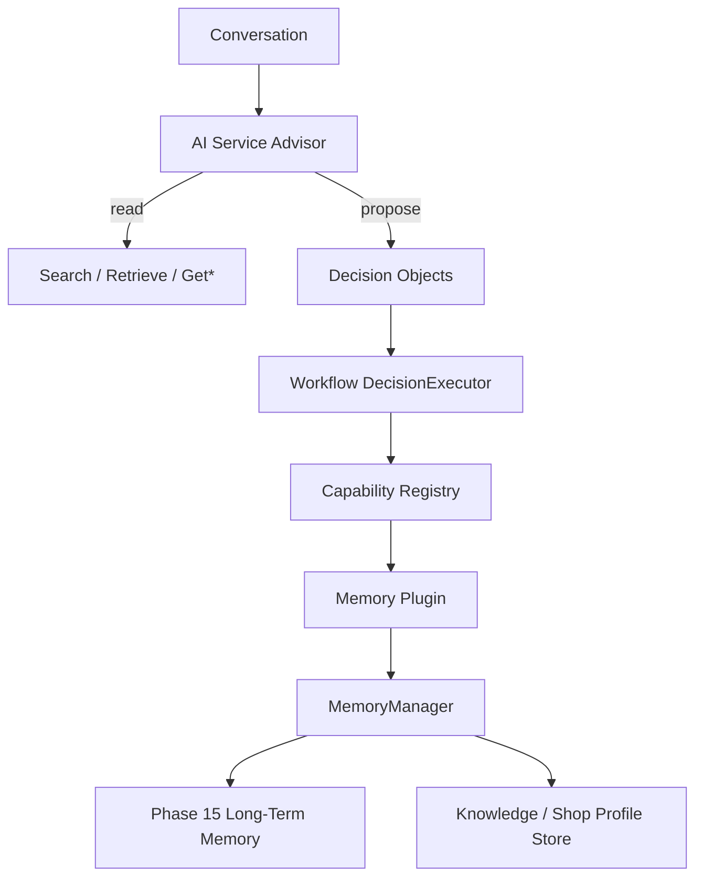
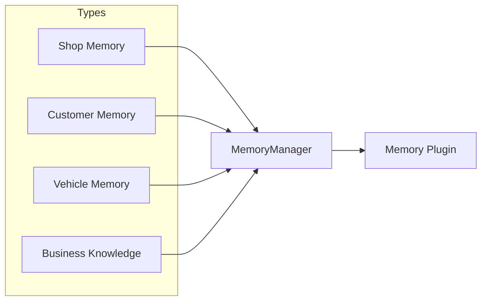
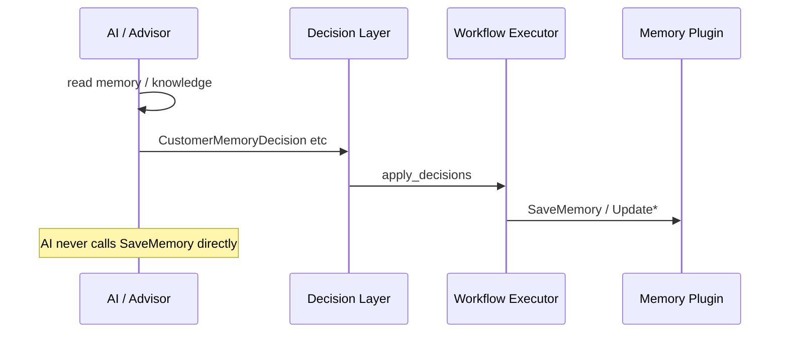
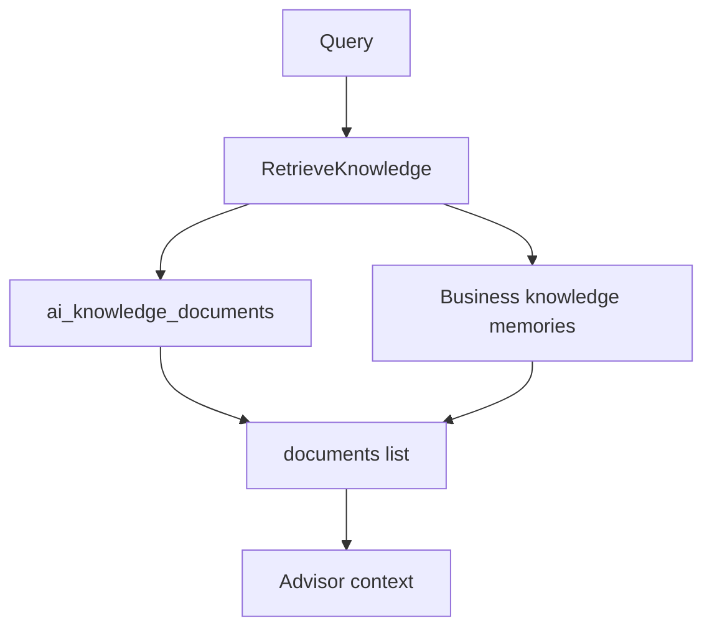
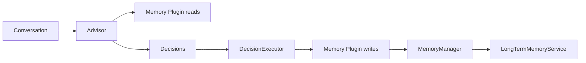

# ADR 0022 — Phase 19 AI Knowledge Base & Shop Memory

Status: Accepted (Phase 19)

## Context

Phase 15 delivered long-term memory (`ai_memories`). The AI Service Advisor
must become **personalized per shop** with Shop / Customer / Vehicle memory
and Business Knowledge — without letting AI agents write memory directly.

## Decision

1. Extend `apps/api/app/memory/` (keep Phase 15 intact) with:

```
memory/
  core/       # interface.py, manager.py, store.py
  shop/       # profile.py, preferences.py
  customer/   # history.py, preferences.py
  vehicle/    # history.py, health.py
  knowledge/  # documents.py, retrieval.py
```

2. Add **Memory Plugin** (`plugins/memory`) with capabilities:
   `SaveMemory`, `SearchMemory`, `GetCustomerHistory`, `GetVehicleHistory`,
   `GetShopPreference`, `RetrieveKnowledge`, `UpdateCustomerProfile`,
   `UpdateVehicleHealth`.
3. AI **may read** (Search / Get* / RetrieveKnowledge). AI **must not** write —
   writes happen only via Decision Objects → Workflow `DecisionExecutor` →
   Memory Plugin capabilities.
4. New Decision types: `CustomerMemoryDecision`, `VehicleMemoryDecision`,
   `ShopPreferenceDecision`, `KnowledgeRetrievalDecision` (read-only apply).
5. Advisor `AnalyzeConversation` soft-loads memory context (read-only).
6. Alembic `0021_phase19_knowledge_memory` — knowledge docs + shop profiles + RLS.
7. **Do not** change Workflow Engine architecture (runner/bus/actions unchanged).



## Memory Architecture Diagram



## Data Flow Diagram



## Knowledge Retrieval Flow



## Decision Mapping

| Decision | Capability / effect |
|---|---|
| CustomerMemoryDecision | SaveMemory / UpdateCustomerProfile |
| VehicleMemoryDecision | SaveMemory / UpdateVehicleHealth |
| ShopPreferenceDecision | SaveMemory + shop profile prefs |
| KnowledgeRetrievalDecision | RetrieveKnowledge (read-only → context) |
| MemoryDecision (legacy) | SaveMemory per fact |

## Dependency Graph



## Migration Report

| Item | Detail |
|---|---|
| Revision | `0021_phase19_knowledge_memory` |
| Parent | `0020_external_integrations` |
| Tables | `ai_knowledge_documents`, `ai_shop_memory_profiles` |
| RLS | shop_id isolation |
| Breaking | None — additive; Phase 15 `ai_memories` unchanged |

## Files Added

- `apps/api/app/memory/core/**`, `shop/**`, `customer/**`, `vehicle/**`, `knowledge/**`
- `apps/api/app/plugins/memory/**`
- `apps/api/app/plugins/advisor/memory_context.py`
- `apps/api/alembic/versions/0021_phase19_knowledge_memory.py`
- `apps/api/tests/memory/test_phase19_knowledge_memory.py`
- `docs/architecture/ADR-0022-phase19-knowledge-memory.md`

## Files Modified

- `memory/enums.py`, `memory/factory.py`
- `plugins/framework/capability.py`, `factory.py`
- `agents/decisions/types.py`, `__init__.py`
- `workflows/decision_executor.py` (handlers only — no engine redesign)
- `plugins/advisor/advisor.py` (read-only memory context)

## Consequences

- Shop personalization via structured memory + knowledge docs.
- Write path is Workflow-gated; AI remains decide/read-only for memory.
- Existing Phase 15 auto_load / auto_capture / HTTP `/v1/memory` preserved.
