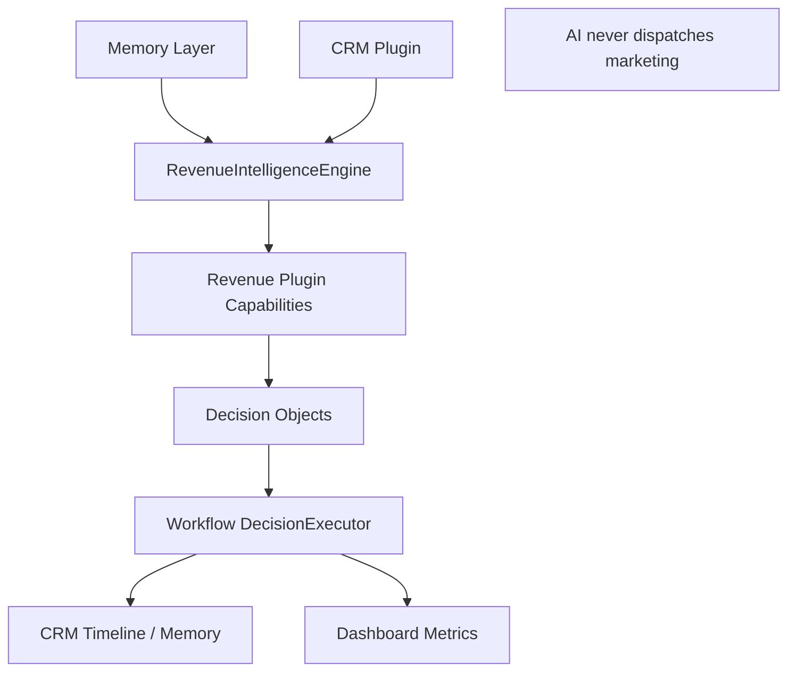
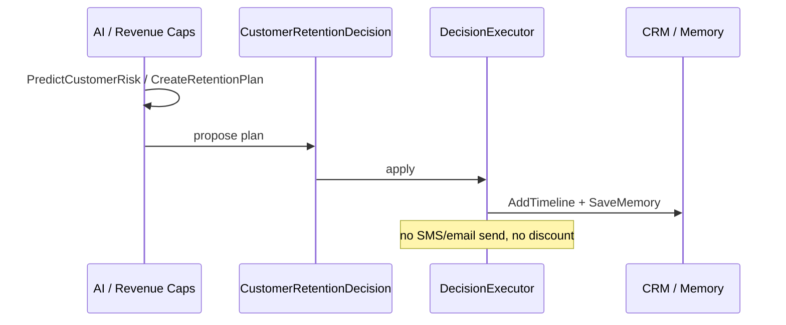
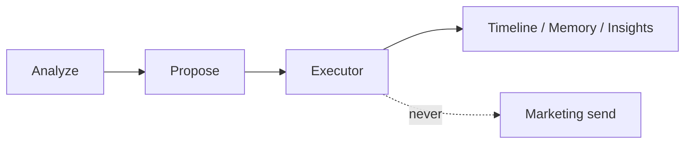
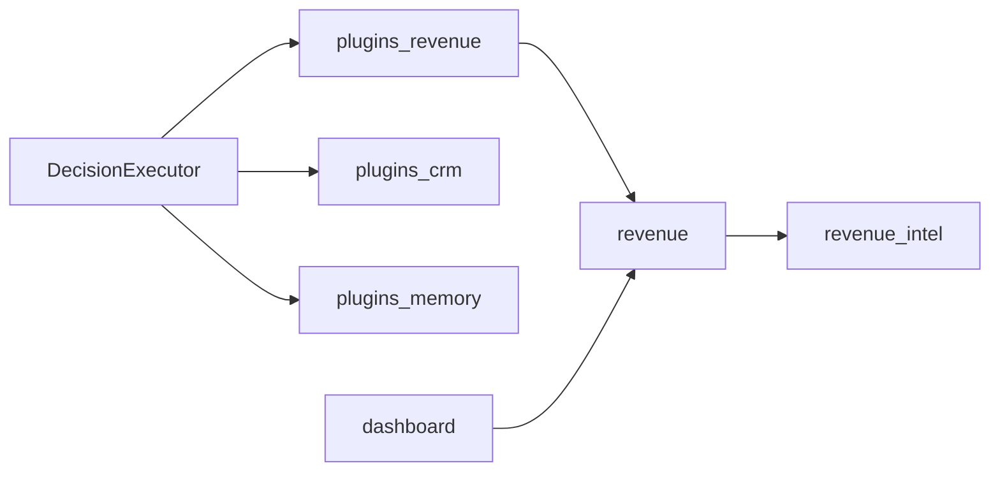

# ADR 0023 — Phase 20 AI Revenue Intelligence & Customer Retention

Status: Accepted (Phase 20)

## Context

Shops need proactive revenue growth and retention. Phase 11 `revenue_intel` and
the Revenue Plugin already detect opportunities. Phase 20 adds a dedicated
intelligence / decision / recommendation layer **without replacing** those
modules, and without letting AI send marketing, change prices, or mutate CRM.

## Decision

1. Add `apps/api/app/revenue/` wrapping `revenue_intel`:

```
revenue/
  intelligence/   # analyzer, predictor, scorer
  decisions/      # retention, opportunity, campaign builders
  recommendations/# service, timing
  engine.py / factory.py / store.py
```

2. Extend Revenue Plugin with capabilities:
   `AnalyzeCustomerValue`, `PredictCustomerRisk`, `DetectRevenueOpportunity` (existing),
   `RecommendService`, `RecommendContactTiming`, `CreateRetentionPlan`,
   `AnalyzeLostRevenue`, `GenerateCampaignSuggestion`.
3. New Decision types applied only by Workflow DecisionExecutor:
   `CustomerRetentionDecision`, `RevenueOpportunityDecision`,
   `ServiceRecommendationDecision`, `ContactTimingDecision`,
   `CampaignRecommendationDecision`, `CustomerValueDecision`.
4. AI may analyze / recommend. AI **must not** send marketing, apply discounts,
   contact customers, or modify CRM — Workflow records timeline/memory/insights only.
5. Dashboard KPIs: retention rate, lost risk, opportunities, recovered revenue,
   service recommendations, campaign performance (suggestions; sent=0).
6. Alembic `0022_phase20_revenue_intelligence`. Workflow Engine architecture unchanged.

## Revenue Intelligence Architecture



## Customer Retention Flow



## Decision Flow



## Capability Mapping

| Capability | Engine method | Side effects |
|---|---|---|
| AnalyzeCustomerValue | analyzer | none |
| PredictCustomerRisk | predictor | none |
| DetectRevenueOpportunity | existing plugin | optional events |
| RecommendService | recommendations | Decision objects |
| RecommendContactTiming | timing | Decision only |
| CreateRetentionPlan | engine | insight store + Decision |
| AnalyzeLostRevenue | analyzer | none |
| GenerateCampaignSuggestion | campaign factory | insight store (no send) |

## Dependency Graph



## Migration Report

| Item | Detail |
|---|---|
| Revision | `0022_phase20_revenue_intelligence` |
| Parent | `0021_phase19_knowledge_memory` |
| Table | `revenue_retention_insights` + RLS |
| Breaking | None |

## Files Added

- `apps/api/app/revenue/**`
- `apps/api/alembic/versions/0022_phase20_revenue_intelligence.py`
- `apps/api/tests/revenue/test_phase20_revenue_intelligence.py`
- `docs/architecture/ADR-0023-phase20-revenue-intelligence.md`

## Files Modified

- `plugins/framework/capability.py`, `factory.py`
- `plugins/revenue/plugin.py`, `factory.py`
- `agents/decisions/types.py`, `__init__.py`
- `workflows/decision_executor.py` (handlers only)
- `dashboard/aggregation.py`, `metrics.py`, `widgets.py`
- `api/routers/health.py`

## Consequences

- Retention/revenue insights are first-class Decisions.
- Marketing Automation remains human/Workflow-gated; campaign suggestions never auto-send.
- Existing `/v1/revenue` and `revenue_intel` nightly analysis preserved.
