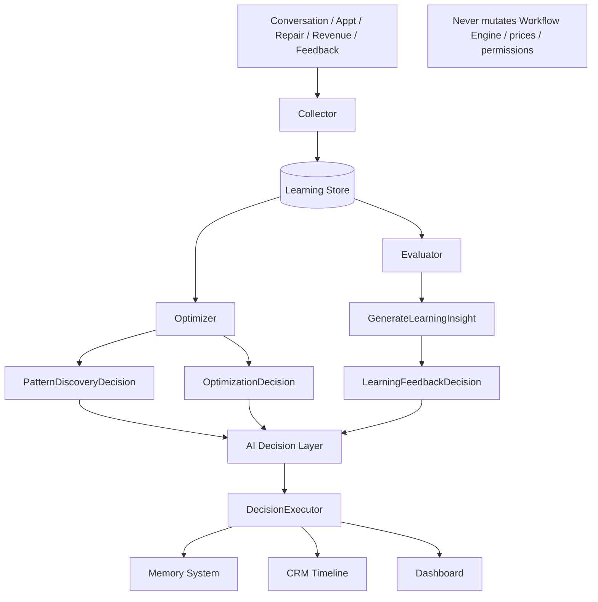
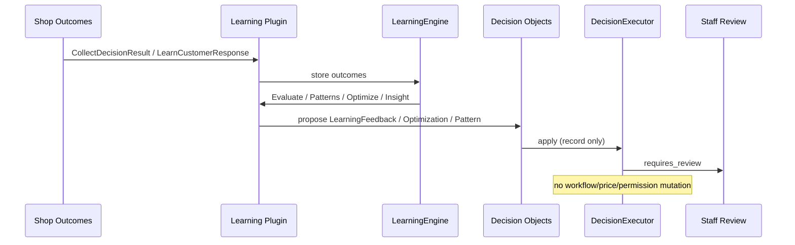
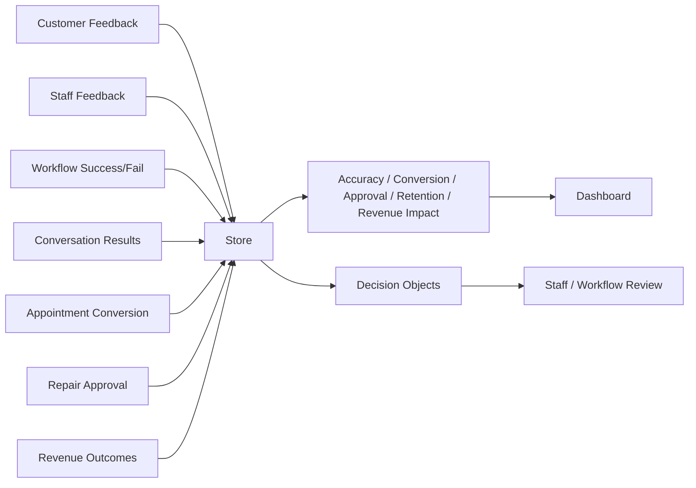
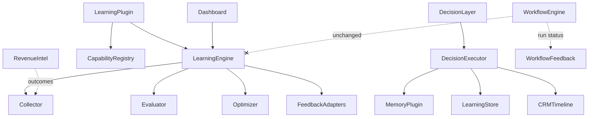

# ADR 0024 — Phase 21 AI Learning Loop

Status: Accepted (Phase 21)

## Context

The AI Service Advisor must improve from real shop outcomes (conversations,
appointments, repairs, revenue, customer/staff/workflow feedback). Improvements
must never be applied autonomously — only proposed as Decision Objects for
Workflow / staff review.

## Decision

1. Add `apps/api/app/learning/`:

```
learning/
  engine.py
  collector.py
  evaluator.py
  optimizer.py
  factory.py
  store.py
  models/
    decision_result.py
    success_pattern.py
    feedback.py
  feedback/
    customer.py
    staff.py
    workflow.py
```

2. Add Learning Plugin capabilities:
   `CollectDecisionResult`, `EvaluateDecision`, `LearnCustomerResponse`,
   `AnalyzeSuccessPattern`, `OptimizeRecommendation`, `GenerateLearningInsight`.

3. Decision types (review-only):
   `LearningFeedbackDecision`, `OptimizationDecision`, `PatternDiscoveryDecision`.

4. AI **can**: analyze outcomes, find patterns, recommend improvements.
   AI **cannot**: modify workflows, change prices, change permissions, or execute
   business actions. `OptimizationDecision.auto_apply` is always ignored.

5. DecisionExecutor records timeline / memory / learning store only.
6. Dashboard KPIs: Decision Accuracy, Appointment Conversion Improvement,
   Repair Approval Rate, Customer Retention Improvement, Revenue Impact.
7. Alembic `0023_phase21_learning_loop`. Workflow Engine architecture unchanged.

## Learning Architecture Diagram



## Feedback Loop Diagram



## Data Flow



## Decision Mapping

| Decision | Source capability | Executor effect |
|---|---|---|
| LearningFeedbackDecision | GenerateLearningInsight / feedback | Timeline + Memory + collect; `rules_changed=False` |
| OptimizationDecision | OptimizeRecommendation | Store feedback/memory; `auto_apply` ignored |
| PatternDiscoveryDecision | AnalyzeSuccessPattern | Persist pattern; never promote to live rules |

## Capability Mapping

| Capability | Engine method | Side effects |
|---|---|---|
| CollectDecisionResult | collector / staff / workflow feedback | Persist outcome/feedback |
| EvaluateDecision | evaluator.evaluate_decision | Read-only metrics |
| LearnCustomerResponse | customer_feedback.learn_customer_response | Feedback + outcome |
| AnalyzeSuccessPattern | optimizer.analyze_success_pattern | Patterns + PatternDiscoveryDecision |
| OptimizeRecommendation | optimizer.optimize_recommendation | OptimizationDecision (`auto_apply=False`) |
| GenerateLearningInsight | generate_learning_insight | LearningFeedbackDecision |

## Dependency Graph



## Integration

| System | Role |
|---|---|
| AI Decision Layer | Hosts LearningFeedback / Optimization / PatternDiscovery |
| Memory System | Stores reviewed learning insights (SaveMemory via executor) |
| Revenue Intelligence | Outcomes feed CollectDecisionResult / revenue_impact metric |
| Workflow Engine | Unchanged; DecisionExecutor extended only |
| Dashboard | Learning Loop widget + KPI fields |

## Metrics

- Decision Accuracy
- Appointment Conversion Improvement
- Repair Approval Rate
- Customer Retention Improvement
- Revenue Impact (`success_rate`, `samples`, `avg_score`)

## Migration Report

| Item | Detail |
|---|---|
| Revision | `0023_phase21_learning_loop` |
| Parent | `0022_phase20_revenue_intelligence` |
| Tables | `learning_decision_results`, `learning_feedback`, `learning_success_patterns` |
| RLS | Shop isolation on all three tables |
| Runtime store | In-memory `InMemoryLearningStore` (DB tables ready for persistence) |

## Files Added

- `apps/api/app/learning/**`
- `apps/api/app/plugins/learning/**`
- `apps/api/alembic/versions/0023_phase21_learning_loop.py`
- `apps/api/tests/learning/test_phase21_learning_loop.py`
- `docs/architecture/ADR-0024-phase21-learning-loop.md`

## Files Modified

- `apps/api/app/agents/decisions/types.py` (+ kinds + 3 decision types)
- `apps/api/app/agents/decisions/__init__.py`
- `apps/api/app/plugins/framework/capability.py` (+6 capabilities)
- `apps/api/app/plugins/framework/factory.py` (register learning plugin)
- `apps/api/app/workflows/decision_executor.py` (+3 handlers; no engine redesign)
- `apps/api/app/dashboard/aggregation.py`, `metrics.py`, `widgets.py`
- `apps/api/app/api/routers/health.py` (`21-ai-learning-loop`)

## Consequences

- Learning improves recommendations only after staff/Workflow review of Decisions.
- Workflow Engine, pricing, and permissions remain outside AI write path.
- Additive migration; existing Phase 1–20 behavior preserved.
