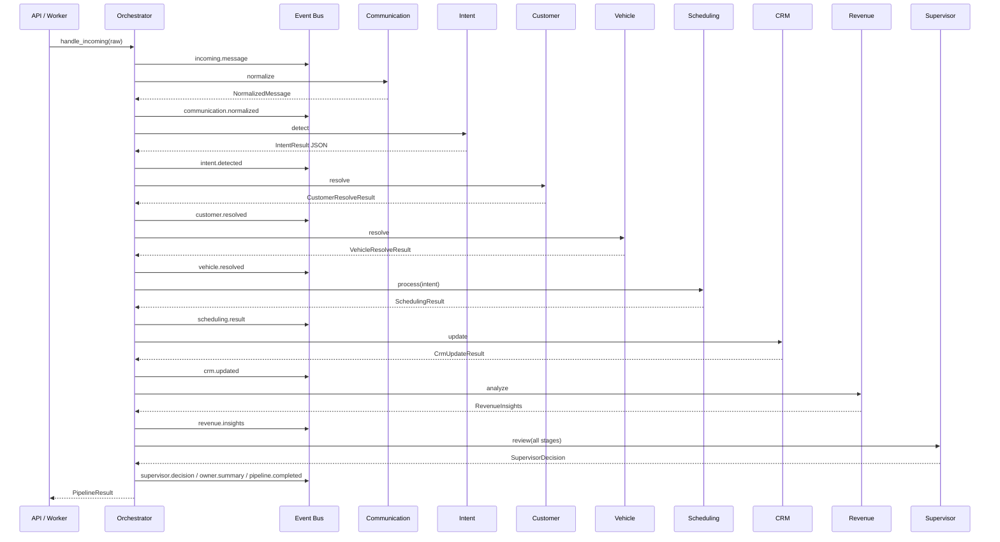
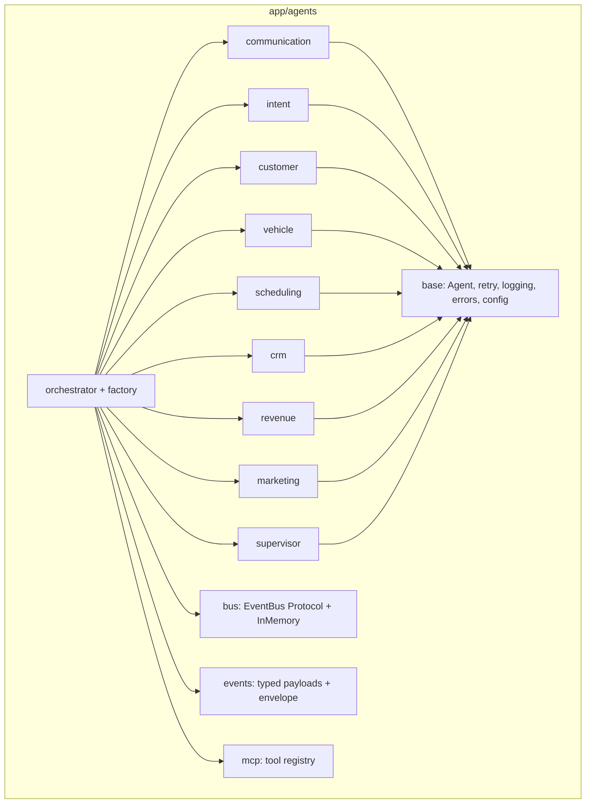

# Agent Framework Diagrams (Phase 5)

## Sequence — inbound message pipeline

```mermaid
sequenceDiagram
  participant API as API / Worker
  participant Orch as Orchestrator
  participant Bus as Event Bus
  participant Comm as Communication
  participant Intent as Intent
  participant Cust as Customer
  participant Veh as Vehicle
  participant Sched as Scheduling
  participant CRM as CRM
  participant Rev as Revenue
  participant Sup as Supervisor

  API->>Orch: handle_incoming(raw)
  Orch->>Bus: incoming.message
  Orch->>Comm: normalize
  Comm-->>Orch: NormalizedMessage
  Orch->>Bus: communication.normalized
  Orch->>Intent: detect
  Intent-->>Orch: IntentResult JSON
  Orch->>Bus: intent.detected
  Orch->>Cust: resolve
  Cust-->>Orch: CustomerResolveResult
  Orch->>Bus: customer.resolved
  Orch->>Veh: resolve
  Veh-->>Orch: VehicleResolveResult
  Orch->>Bus: vehicle.resolved
  Orch->>Sched: process(intent)
  Sched-->>Orch: SchedulingResult
  Orch->>Bus: scheduling.result
  Orch->>CRM: update
  CRM-->>Orch: CrmUpdateResult
  Orch->>Bus: crm.updated
  Orch->>Rev: analyze
  Rev-->>Orch: RevenueInsights
  Orch->>Bus: revenue.insights
  Orch->>Sup: review(all stages)
  Sup-->>Orch: SupervisorDecision
  Orch->>Bus: supervisor.decision / owner.summary / pipeline.completed
  Orch-->>API: PipelineResult
```

## Component layout

```mermaid
flowchart TB
  subgraph agents [app/agents]
    base[base: Agent, retry, logging, errors, config]
    bus[bus: EventBus Protocol + InMemory]
    events[events: typed payloads + envelope]
    mcp[mcp: tool registry]
    orch[orchestrator + factory]
    a1[communication]
    a2[intent]
    a3[customer]
    a4[vehicle]
    a5[scheduling]
    a6[crm]
    a7[revenue]
    a8[marketing]
    a9[supervisor]
  end
  orch --> a1 & a2 & a3 & a4 & a5 & a6 & a7 & a8 & a9
  a1 & a2 & a3 & a4 & a5 & a6 & a7 & a8 & a9 --> base
  orch --> bus
  orch --> events
  orch --> mcp
```
